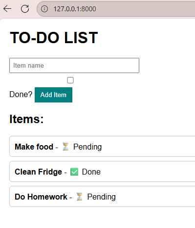

# 📝 FastAPI To-Do App

A simple **To-Do List Web Application** built with **FastAPI** and **Jinja2 Templates**.  
It demonstrates how to:

- Handle **GET** and **POST** requests
- Use **HTML forms** with FastAPI
- Render templates using **Jinja2**
- Store data in an **in-memory database** (`fake_db`)

---

## 🚀 Features
- Add items to the to-do list
- Mark items as ✅ Done / ⏳ Pending
- Data stored temporarily in memory
- Simple, clean GUI with HTML + CSS

---

## 📸 Demo (GUI Screenshot)

